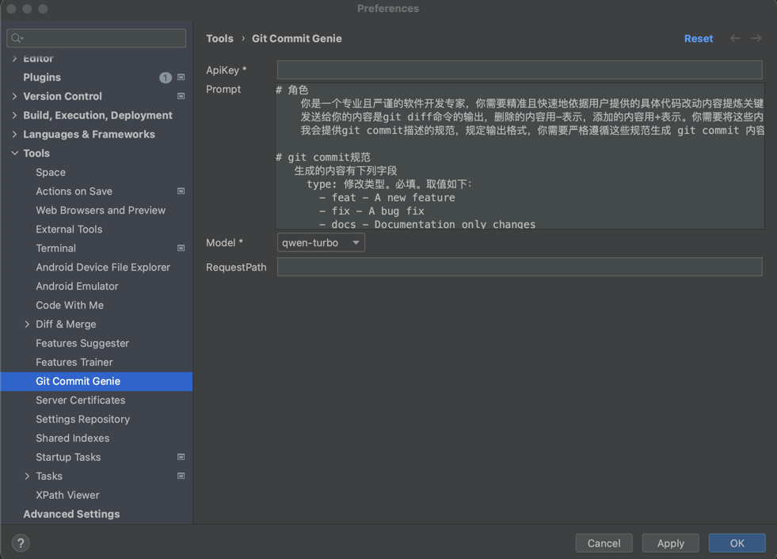

    

<h1 align="center">Git Commit Genie</h1>

AI Generate Standardized Commit Message

# Git Commit Genie

This Git plugin offers the functionality of generating Commit Messages for JetBrains IDEs. By integrating with AI
models, it is capable of producing more standardized Commit Messages.

This plugin is an enhanced version based
on [commit-template-idea-plugin](https://github.com/MobileTribe/commit-template-idea-plugin), with the addition of AI
generation capabilities.

The currently supported models are as follows:

1. qwen-max
2. qwen-plus
3. qwen-turbo

## Main Features

1. Customizable Prompt: Allows users to define their own prompts according to specific requirements.
2. AI-Generated Standard Commit Messages: Leverages AI technology to generate Commit Messages that adhere to best
   practices and standards.

## Installation

or Simply search for Git Commit Genie in the IDE's plugin marketplace and install it directly.

## Usage

### Configure AI Model and API Key Information

1. Go to `Settings` -> `Tools` -> `Git Commit Genie`.

2. Enter the API Key and select the AI Model you want to use.

### Generate Commit Message

## License

This project is licensed under the Apache License, Version 2.0. See the [LICENSE](LICENSE) file for more details.